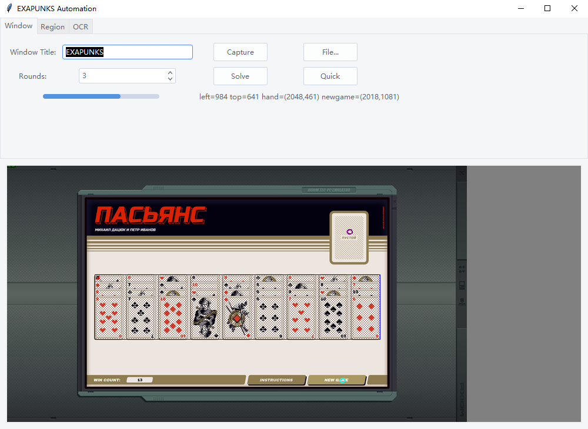
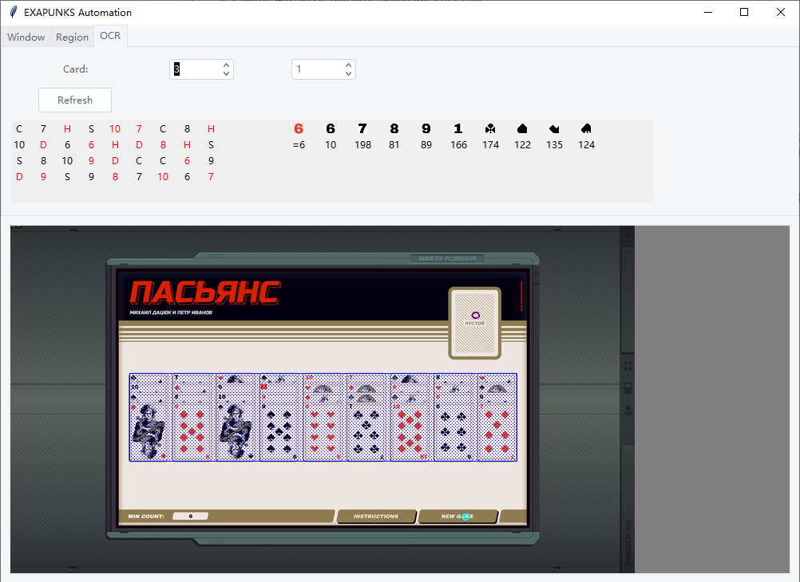

# Exapunks Automation

This repository solves Exapunk's Solitaire minigame, ПАСЬЯНС. This repository is useable, but only with specific display conditions (more on that below under Usage)

- Forked from https://github.com/Will-Crain/Exapunks-Automation
- Support dynamic resolution, whether fullscreen or not
- A simple GUI with dynamic boundary settings
- Template under `res` folder is not used anymore, a pattern-based recognition method is adopted

# Example of solution





# Usage & Installation
This project uses Pillow, pyautogui and tkinter. Developed with py3.12, should work with py>=3.10.

```bash
python -m pip install Pillow pyautogui git+https://github.com/RedFantom/ttkthemes

# Run Gui
python Gui.py

# Run Will-Crain's Script
python main.py
```

The card recognition algorithm is based on resolution 1920x1080. For low resolutions like 1366x768, you may need to enlarge `OCR size` (14 to 16).
